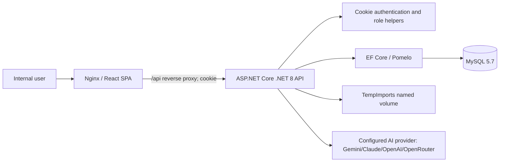
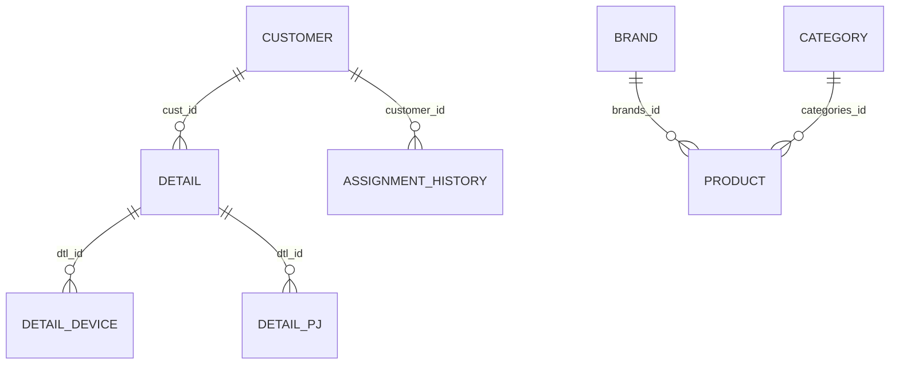

# Telesales Modernization System Handoff and Audit

**Audit date:** 2026-07-23  
**Evidence scope:** Current repository runtime code, configuration, Docker assets, tests, and safe local build/test commands. No production database, deployment host, secrets, or external AI provider was accessed. Sensitive settings are masked.

## 1. Executive summary

The system is an internal telesales console for managing customers, contacts, device/project detail, cost sheets, master data, imports, reports, and an AI chat assistant. The confirmed stack is React 19/Vite/TypeScript, ASP.NET Core .NET 8 Web API, EF Core with Pomelo MySQL, MySQL 5.7, and Docker Compose/Nginx.

The SPA uses cookie authentication and the API applies role checks in controllers and helper extensions. The repository has usable deployment assets, database health checks, named persistent volumes, backend/frontend tests, and an implemented import preview/commit workflow. However, access scopes currently give every authenticated Sales and Tele Sale user access to every customer, and the Users API exposes `linetoken` to assignment-capable users. There are no EF migrations, API integration tests against MySQL, global exception middleware, rate limiting, CSP/HSTS, or demonstrated production monitoring.

| Area | Assessment |
|---|---|
| Main modules | Customer/contact/device/project workflow, cost sheets, master data, imports, reports, AI chat |
| Roles | Super Admin, Admin, Manager, Supervisor (recognized in code but not DB enum), Sale, Tele Sale, Viewer |
| Deployment | Nginx SPA reverse-proxying `/api` to a private .NET container; private MySQL named volume |
| Maintainability | Conditional: clear feature grouping and tests, but very large controllers, duplicated role/status logic, no migrations |
| Security | Not ready without remediation of high-priority authorization/privacy issues |
| Stability | Conditional for controlled internal use; transactional import paths exist but broad write workflows are not consistently transactional |
| Test status | 66 frontend tests passed; backend `dotnet test --no-restore` exited 0 (the run did not print a test count) |
| Readiness | **Not ready for production** based on reviewed evidence |

Top five next actions:

1. Implement actual per-owner/customer assignment scoping or explicitly approve the global-read policy; enforce it in `ApplyCustomerScope` and `HasCustomerAccessAsync`.
2. Remove `linetoken` from `GET /api/users`, rotate any exposed token, and return a least-privilege DTO.
3. Introduce centralized authorization policies, CSRF/origin protections for cookie writes, rate limiting, and production security headers/TLS enforcement.
4. Create a migration/schema-management strategy and upgrade MySQL 5.7 through a tested project.
5. Add integration tests with a disposable MySQL database for authorization, imports, and status transitions; add logging/monitoring/alerting.

## 2. System map and architecture

### Repository map

| Location | Purpose |
|---|---|
| `Frontend/` | Vite SPA, views/components/domain API client and Vitest tests |
| `Backend/Telesale.Api/` | .NET 8 controllers, EF Core context/models, services, templates |
| `Backend/Telesale.Api.Tests/` | xUnit-style unit/controller/service tests |
| `myserver/` | Docker Compose, Nginx config, build images, backup/restore/verification scripts |
| `docs/` | Existing implementation specs/plans and this handoff |

The app is a single-page client with in-memory view navigation (no React Router). `apiService.ts` is the main API integration layer. `Program.cs` configures DI, cookie auth, EF Core, CORS for local Vite, optional startup initialization, and controller routing. Controllers directly orchestrate EF queries and business logic; import and AI behavior is partially factored into services.

## 3. Frontend guide

**Entry:** `Frontend/src/main.tsx` -> `App.tsx`. React 19, TypeScript 5.7, Vite 5.4, Lucide; no Redux/router/form framework. Session identity metadata is cached in `localStorage` under `ats_user`; the credential is an HttpOnly `ATS_Auth` cookie, not local storage.

| View / state key | Purpose | UI roles | Primary API area |
|---|---|---|---|
| `manage` | Customer search, CRUD, contact/device/project workflow, status/advance | Admin, Manager, Supervisor, Sale, Tele Sale, Viewer (writes hidden for Viewer) | `/customers` |
| `cost-sheet` | Cost-sheet list/create/status/delete | UI lacks this permission for all listed roles; backend permits authorized non-viewers subject to controller checks | `/costsheets` |
| `reports` | Operation, renewal, project-detail reporting | Admin, Manager, Supervisor, Viewer | `/customers/reports/all` |
| `master-data` | Profiles, antivirus price lists, products, brands, business types, categories, users, competitors | UI role-filtered | `/masterdata/*`, `/users` |
| `import-customers` | Customer import preview, mapping, validation, streamed commit | Admin/Super Admin | `/import/customers/*` |
| `import-history` | Import session history | Admin/Super Admin | `/import/history` |

`domain/permissions.ts` handles presentation-level visibility but must not be treated as security. The API uses `credentials: include` in its shared request helper; several direct `fetch` upload/download calls omit an explicit `credentials` setting, which works same-origin in Compose but will not carry cookies in cross-origin development.

Known UX/accessibility notes: semantic buttons and navigation labels are present in `App.tsx`; no dedicated accessibility audit, keyboard test suite, route deep-linking, or client-side error boundary was found. Loading and toast/error states are implemented in views/components, but error formats differ by endpoint.

## 4. Backend and API guide

**Runtime:** `Backend/Telesale.Api/Program.cs`; target framework `net8.0`. EF Core context: `Data/TelesaleDbContext.cs`. No repository layer; controllers query the context directly. DI registers import services, AI provider clients/services, email service, and HTTP clients.

### API inventory (grouped)

| Method | Route | Purpose | Auth / authorization | Main frontend caller |
|---|---|---|---|---|
| POST | `/api/auth/login` | BCrypt login, lockout, cookie sign-in | Anonymous | Login view |
| POST / GET | `/api/auth/logout`, `/api/auth/me` | Cookie sign-out / current identity | Logout anonymous in implementation; `me` authenticated | App/API client |
| GET/POST/PUT/PATCH/DELETE | `/api/customers`, `/api/customers/{id}`, `/api/customers/{id}/status` | Customer list, create, update, status, delete | Authenticated plus helper role/access checks | Customer Manage |
| GET/POST/PUT/DELETE | `/api/customers/{id}/contacts`, `/api/customers/contacts/{id}` | Contact operations | Authenticated + workflow/access checks | Customer Manage |
| GET/POST/PUT/DELETE | `/api/customers/contacts/{contactId}/devices`, `/api/customers/devices/{id}` | Device operations | Authenticated + workflow/access checks | Customer Manage |
| GET/POST/PUT/DELETE | `/api/customers/contacts/{contactId}/projects`, `/api/customers/projects/{id}` | Project operations | Authenticated + workflow/access checks | Customer Manage |
| GET | `/api/customers/reports/all` | Report data | Authenticated, report role check | Reports |
| GET/POST/PUT/DELETE | `/api/costsheets[/{id}]`, `/api/costsheets/{id}/status` | Cost-sheet workflow | Authenticated; verify controller-specific role conditions before extending | Cost Sheet |
| GET/POST/PUT/DELETE | `/api/masterdata/{brands,products,antivirus-prices,business-types,categories,competitors,profiles}` | Master data | Authenticated, role-specific checks | Master Data |
| GET | `/api/users` | Assignment/user list | Authenticated; Admin/Manager/Supervisor helper | Master Data / assignments |
| GET | `/api/dashboard/summary` | Dashboard summary | Authenticated | No confirmed current SPA caller |
| POST | `/api/ai-chat` | AI chat using customer context | Authenticated + management-read role | AI widget |
| GET | `/api/import/templates/*` | Download templates | Authenticated (controller class); role behavior should be kept aligned with imports | Import views |
| POST | `/api/import/{manage,profile,antivirus-price-list}` | Validate/optionally commit legacy imports | Admin or Manager | Import views |
| POST | `/api/import/local-government/{preview,confirm}` | Local-government import | Admin | Local-government modal |
| POST/GET | `/api/import/customers/{preview,suggest-mappings,extract-unstructured,validate,preview-page,validate-file,explain-issue,commit-stream,commit}` | Customer import stages | Admin | Import Customers |
| GET | `/api/import/customers/{export-errors}` and `/api/import/history` | Error export/import audit data | Admin | Import views/history |
| GET | `/api/health`, `/api/health/db` | Liveness/database check | Public | Compose healthcheck uses `/api/health` |

Input DTOs are used for most writes. Search uses normalized multi-token logic (`Services/CustomerSearch.cs`) and customer list validates page 1..N and page size <=100. The ordinary no-page list branch remains unbounded.

## 5. Database guide

The database model is reverse-engineered in `TelesaleDbContext`; no EF `Migrations/` directory was found. Schema/migration history cannot be proven from source alone. Model collation is `utf8_unicode_ci` (not `utf8mb4`).

| Table | Purpose | Key relationships / indexes |
|---|---|---|
| `user` | Identities, roles, BCrypt password, lockout fields | unique `username`, `email` |
| `customer` | Company/customer record | references are scalar IDs; no modeled FK for owner/sale/telesale/business type |
| `detail` | Customer contact/detail | FK/index `cust_id` -> customer |
| `detail_device` | Contact device/license detail | FK/index `dtl_id` -> detail |
| `detail_pj` | Contact project detail | FK/index `dtl_id` -> detail |
| `assignment_history` | Assignment audit | FK/index `customer_id` -> customer |
| `cost_sheet` | Quotations/cost sheets | match to customers by company name in read model, not FK |
| `brand`, `category`, `product`, `business_type`, `profile`, `competitor`, `antivirus_price_list` | Master data | product FKs/indexes to brand/category |
| `import_sessions`, `import_rows` | Import history/row records | `session_id` is scalar; FK not modeled |
| `target`, `log`, `password_reset`, `migration` | Legacy/auxiliary structures | `password_reset` and `migration` are keyless in model |

Key query risks: customer name has no verified unique/index constraint despite import matching it as a normalized company key; import lookup loads all active customers then normalizes in memory; reports/customer projections contain correlated subqueries; unpaged customer/history variants can materialize large data. Add indexes only after examining production query plans and existing schema because the context is not authoritative for all physical indexes.

## 6. Confirmed workflows

### Authentication

`LoginView` calls `/api/auth/login`; `AuthController` finds by username, verifies BCrypt, locks after five failures for 15 minutes, resets lockout metadata on success, and signs a persistent 30-minute sliding cookie. Claims contain username, ID, role, and position. `App.tsx` calls `/api/auth/me` on load and caches display metadata. Logout signs out server-side then clears cached metadata. There is no refresh token; cookie expiry/session invalidation is the mechanism. Successful logout invalidates the cookie, but no server-side session revocation list exists.

### Customer search/create/edit/status

Customer list accepts page/pageSize/search/completeness/missing field/business type/sale/telesale/status. Search is normalized to tokens and dispatched to `CustomerSearch`; tests cover multi-token behavior. Create/update/contact/device/project writes are direct EF controller flows. Empty contact name/email are supported by nullable detail properties and import logic; a contact is created during import only when at least one contact field has data. Status is validated through `StatusPolicy`; direct API calls cannot submit unlisted status values, but the UI confirmation is not itself a security boundary.

### Customer import

Admin-only customer preview stores `.csv`/`.xlsx` inputs under `TempImports` using a generated file ID; mapping, validation, duplicate detection, error export and manual/stream commits follow. Input size is capped at 10 MB. Matching is application-level normalized company name (trim, collapse whitespace, uppercase), and existing duplicate names are deterministically resolved to first ID rather than rejected. Existing matched customers are updated, but `UpdateImportedCustomerAsync` does not write `start_dt`, so the start date is preserved. New customers receive today's start date. Commit logic uses EF transactions in the examined legacy and import commit paths; verify exact streaming partial-failure behavior against a disposable MySQL database before relying on it operationally. Error CSV escaping does not neutralize spreadsheet formula prefixes.

### Advance/call status and reports

The React customer workspace requires status confirmation before advancing; `PATCH /customers/{id}/status` validates the status on the server. Booking/assignment endpoints currently return “no longer supported.” Reports are obtained from `/customers/reports/all`, with UI tabs for operation, renewal and project detail. No confirmed export workflow was found.

### AI chat

Authenticated management readers may send <=500-character messages. The server blocks a small list of secret-related prompt phrases and otherwise delegates to configured provider services. This is an assistant capability, not a complete prompt-injection/data-loss control; outgoing customer context and provider retention terms need a separate privacy approval.

## 7. Security audit

## SEC-001 - Customer access scope is global for sales roles

**Severity:** High  
**Confidence:** High  
**Affected area:** Customer, contact, device, and project APIs  
**Evidence:** `Backend/Telesale.Api/Helpers/AuthExtensions.cs` (`ApplyCustomerScope`, `HasCustomerAccessAsync`) returns the full query/true for Admin, Manager/Supervisor, Sale and Tele Sale.  
**Impact:** Any authenticated Sales or Tele Sale user can read and modify every customer record, including contacts and details, rather than only assignments.  
**Recommended remediation:** Define ownership/assignment rules, enforce query predicates by user/position, add object-level authorization tests, and make assignment support consistent with that model.  
**Validation:** authenticate as two agents and verify cross-assignment list/read/update returns 403/empty scope.

## SEC-002 - User API returns LINE tokens

**Severity:** High  
**Confidence:** High  
**Affected area:** User directory  
**Evidence:** `Backend/Telesale.Api/Controllers/UsersController.cs`, `GetUsers`, selects `linetoken = u.linetoken`.  
**Impact:** Admin, Manager and Supervisor users able to call this endpoint receive token-like credentials for all active users.  
**Recommended remediation:** remove the field from all API DTOs, rotate affected tokens, restrict directory fields, and audit logs/client caches.  
**Validation:** inspect response for an authorized user; it must never contain token/secret fields.

## SEC-003 - Cookie-authenticated writes lack explicit anti-CSRF defense

**Severity:** Medium  
**Confidence:** Medium  
**Evidence:** `Program.cs` uses cookie authentication with `SameSite=Lax`; no antiforgery middleware/token or origin/referer validation is configured.  
**Impact:** Defense relies on browser SameSite behavior and deployment topology; a future cross-site or same-site deployment change could expose write endpoints.  
**Recommended remediation:** enforce antiforgery tokens or strict Origin validation for unsafe methods, set `Secure=Always` in TLS deployments, and document trusted origins.

## SEC-004 - No global rate limiting; lockout enables account-focused DoS

**Severity:** Medium  
**Confidence:** High  
**Evidence:** Auth has per-account 5-failure/15-minute lockout but `Program.cs` adds no rate limiter; API/import/AI endpoints have no rate policy.  
**Impact:** Attackers can lock targeted accounts and exhaust costly AI/import resources.  
**Recommended remediation:** add IP + username login throttles, endpoint-specific concurrent/queue limits, and monitoring.

## SEC-005 - Error export allows spreadsheet formula injection

**Severity:** Medium  
**Confidence:** High  
**Evidence:** `ImportController.cs` `ExportValidationErrors` CSV helper quotes/escapes but does not prefix values beginning `=`, `+`, `-`, or `@`.  
**Impact:** Opening a malicious uploaded value in spreadsheet software can execute formulas.  
**Recommended remediation:** prefix dangerous leading characters with an apostrophe for every exported cell; test each prefix.

## SEC-006 - Production browser hardening is incomplete

**Severity:** Medium  
**Confidence:** High  
**Evidence:** `myserver/frontend/nginx.conf` sets nosniff, referrer policy, and X-Frame-Options but no CSP, HSTS, Permissions-Policy, or HTTPS listener/redirect.  
**Impact:** TLS and several browser protections are external assumptions, not enforced by the delivered stack.  
**Recommended remediation:** terminate TLS at an approved proxy, enforce HTTPS/HSTS there, define a tested CSP and Permissions-Policy.

## SEC-007 - MySQL 5.7 is end-of-life and transport is unencrypted inside Compose

**Severity:** Medium  
**Confidence:** High  
**Evidence:** `myserver/compose.yaml` defaults to `mysql:5.7` and uses `SslMode=None`.  
**Impact:** unsupported DB version and no in-network DB encryption.  
**Recommended remediation:** plan a tested MySQL 8+ migration; assess whether the private host/bridge network meets the threat model and enable TLS where required.

Other checked controls: BCrypt password verification and lockout are present; JWT is not used; no plaintext fallback was found; template path construction has a containment check; uploads have a 10MB size cap and extension restrictions in reviewed customer preview code. File signature/ZIP-bomb limits, centralized audit logging, and secrets-history verification were not established.

## 8. Stability, performance, and maintainability

## STAB-001 - No global exception/error response middleware

**Severity:** Medium. **Evidence:** `Program.cs` maps controllers without an exception handler; controllers often return ad hoc anonymous error objects.  
**Failure scenario:** unexpected EF/provider exception produces inconsistent errors and may expose details depending on hosting defaults.  
**Remediation:** add production exception middleware with correlation ID, RFC 7807 response, safe logging, and integration tests.

## STAB-002 - Customer graph writes are multi-save without explicit transaction

**Severity:** Medium. **Evidence:** customer/controller contact/device/project operations perform independent `SaveChangesAsync` calls and point recalculation; no encompassing explicit transaction was found in those routines.  
**Impact:** failure after a dependent write can leave inconsistent point/child state.  
**Remediation:** make each multi-table command a transaction and test injected failures.

## STAB-003 - Import staging files have no demonstrated retention cleanup

**Severity:** Medium. **Evidence:** customer preview writes generated files to `/app/TempImports` named volume; no scheduled cleanup was found.  
**Impact:** persistent disk growth and retained customer data.  
**Remediation:** expiry metadata/cleanup job, restricted file permissions, safe deletion after completion, and observability.

## STAB-004 - Unbounded data paths and non-sargable/in-memory import matching

**Severity:** Medium. **Evidence:** customer and import-history endpoints have unpaged branches; import matching loads all active customers and normalizes names in memory.  
**Remediation:** require pagination, cap reports, measure SQL plans, and use a normalized indexed key after data cleanup.

| ID | Priority | Area | Issue | Recommended action | Effort |
|---|---|---|---|---|---|
| TD-001 | P0 | Authorization | Global sales access conflicts with assignment concepts | Implement object scope/policies | Medium |
| TD-002 | P0 | Privacy | `linetoken` disclosure | Remove/rotate/retest | Small |
| TD-003 | P1 | Database | No source migrations; MySQL 5.7 EOL | Establish migration baseline and upgrade project | Large |
| TD-004 | P1 | Reliability | Large controllers/direct EF orchestration | Extract command/services around transactional flows | Medium |
| TD-005 | P1 | Observability | No centralized exception handler/monitoring | Add structured logging, health/metrics/alerts | Medium |
| TD-006 | P2 | Consistency | Roles/statuses duplicated between TS and C# | Shared contract/constants or contract tests | Medium |
| TD-007 | P2 | Frontend | No URL routes/deep links | Add router if supported product requirement | Medium |

## 9. Testing and validation

| Command | Result | Notes |
|---|---|---|
| `dotnet test Telesale.sln --no-restore` | Passed (exit 0) | Output contained no test summary/count; manual review of test project confirms customer search/import/contact/status/AI controller tests exist |
| `npm test -- --run` | Passed | 11 files, 66 tests |
| `npm run build` | Passed | TypeScript build + Vite production build; main JS output about 400 kB before gzip |

No live MySQL integration, Docker compose startup, lint (no lint script), E2E/browser run, external AI call, backup restore, or production security scan was executed. Recommended regression checks: valid/invalid/locked login; each role's list/read/write denial; empty contact fields; all-token search; new/update/duplicate import and start-date preservation; malformed/oversize import; status confirmation/API invalid status; reports pagination; expired session; Docker restart/persistence; database restore rehearsal.

## 10. Deployment and operations runbook

### Deployment topology

Run from `myserver/`. Compose services: `database` (private, persistent `mysql-data`), `backend` (private, `temp-imports` volume), `frontend` (only public port, default 80), and optional localhost-only phpMyAdmin profile. All application services have restart policies and health checks. Backend image runs as non-root `app`; Nginx runtime user behavior was not verified from image configuration.

### Start / verify

1. Install Docker Compose v2 and create `myserver/.env` from `.env.example`; set `DB_PASSWORD=***`, `DB_ROOT_PASSWORD=***`, and provider keys only where needed.
2. Validate: `docker compose config`.
3. For an existing system, start only database, restore a reviewed logical dump using `scripts/restore-database.(sh|ps1)`, then `docker compose up -d --build`.
4. Verify: `docker compose ps`, `scripts/verify-deployment.(sh|ps1)`, `/api/health`, login, customer search, and representative import/report paths.

### Stop / backup / restore

Use `docker compose stop` or `docker compose down` to preserve named volumes. **Do not use `docker compose down -v`** unless deletion of MySQL and staged import data is intentional. Run `scripts/backup-database.(sh|ps1)` to a secured path outside the repository; dumps contain personal/business data. Restore only after confirming target/database state; scripts prompt when tables exist. Automatic initialization is disabled in production by `RUN_DATABASE_INITIALIZER=false`.

### Common diagnostics

| Symptom | Safe diagnostic / resolution |
|---|---|
| SPA cannot call API | Check frontend/backend health and Nginx `/api/` proxy logs; verify `X-Forwarded-Proto`/TLS proxy configuration |
| Backend cannot connect to DB | `docker compose ps`, database health, masked connection variable names, then backend logs; do not reset volumes |
| Login fails | Check account active/lockout fields using approved DB access; wait/unlock through approved procedure, never expose password hashes |
| Import rejected | Check 10MB size, required format/headers, validation response, and staged-volume capacity |
| No reports/data | Confirm role, API response, customer status/filter values, and scope behavior |
| Lost data after recreate | Verify named volumes; restore tested logical backup; never use `down -v` casually |

Production assumptions/gaps: TLS must be handled by external infrastructure; DB is not host-published; secrets must remain in untracked `.env`; no CI/CD workflow or production log aggregation was found. Backups require encryption, access control, off-host retention, and periodic restore testing.

## 11. Maintenance guide and roadmap

Follow current conventions: add a view in `Frontend/src/views`, add its state/menu/permission in `App.tsx` and `domain/permissions.ts`, add API client methods in `domain/apiService.ts`, create DTO/controller behavior under `Backend/Telesale.Api`, register a service in `Program.cs`, map schema changes in EF plus a controlled migration process, and add Vitest plus backend tests. For a new role/status, update both C# (`AppRoles`/`StatusPolicy`) and TypeScript domain constants/tests until a shared contract exists. For imports, add a template under `Backend/Telesale.Api/templates`, enforce role/file/row limits, validation, transaction semantics, cleanup, and formula-safe error export.

**Immediate hardening:** resolve SEC-001/002, add CSRF/rate limits/security headers, rotate credentials, create migration baseline, and rehearse backup/restore.

**Near term:** MySQL integration tests, transactional command boundaries, global error middleware, pagination/SQL performance measurements, import cleanup/audit trail, structured logging and alerts.

**Next evolution:** central permission model; audit history; import rollback/background processing; CI/CD with staging; automated encrypted backups; AI enrichment only with explicit human approval and provider data-processing review.

## 12. Unverified or not found

Not verified from current code: live database schema/data/indexes, reverse-proxy TLS configuration, secret history, provider retention/configuration, actual role assignments, monitoring/alerting, backup restore success, production environment values, malware scanning or file signatures, external email behavior, audit-log retention, and a complete CI/CD pipeline. Booking and assignment endpoints are present but explicitly report unsupported behavior; no confirmed notification, export, or user create/edit API was found.
